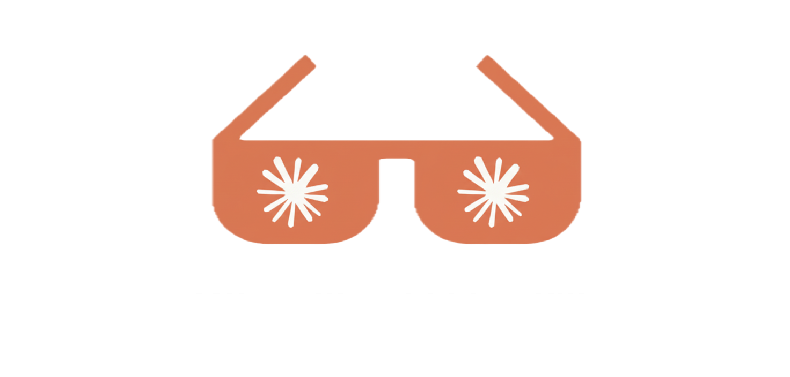

<div align="center">
	<br>
	<br>
	<div>
		<picture>
			<source media="(prefers-color-scheme: dark)" srcset="media/logo.png">
			
		</picture>
		<br>
	</div>
	<p>
		<a href="https://www.anthropic.com/news/skills">Claude skills</a> are reusable, filesystem-based resources that provide Claude with domain-specific expertise developed by <a href="https://www.anthropic.com/">Anthropic</a>
	</p>
	<br>
	<a href="https://awesome.re">
		
	</a>
	<br>
	<br>
</div>

## Contents

- [Getting Started](#getting-started)
- [Skill Library](#skill-library)
  - [Official Skills](#official-skills)
  - [Official Third-Party Skills](#official-third-party-skills)
  - [Community Skills](#community-skills)
- [Ecosystem & Resources](#ecosystem--resources)
  - [Official Documentations](#official-documentations)
  - [Blog Posts](#blog-posts)
- [Contributing](#contributing)

## Getting Started

Skills are available for all paid subscription plan.

### Claude.ai (Desktop)

[Enable Skills in your settings](https://claude.ai/settings/capabilities)

### Claude Code

```bash
/plugin marketplace add anthropics/skills
/plugin install document-skills
```

### API & SDKs

Skills can be accessed programmatically via the [`/v1/skills`](https://docs.claude.com/en/api/skills) endpoint and leveraged in custom agents built with the Claude Agent SDK.

## Skill Library

### Official Skills

| Skill                                                                                     | Description                                                                                                  | Use Cases                                                                                         |
| :---------------------------------------------------------------------------------------- | :----------------------------------------------------------------------------------------------------------- | :------------------------------------------------------------------------------------------------ |
| **[docx](https://github.com/anthropics/skills/tree/main/document-skills/docx)**           | Create, edit, and analyze Word documents with support for tracked changes, comments, and formatting.         | Draft reports, edit legal documents, and manage document templates.                               |
| **[pdf](https://github.com/anthropics/skills/tree/main/document-skills/pdf)**             | Extract text/tables, create new PDFs, merge/split documents, and handle forms.                               | Process invoices, extract data from reports, and assemble PDF documents.                          |
| **[pptx](https://github.com/anthropics/skills/tree/main/document-skills/pptx)**           | Create, edit, and analyze PowerPoint presentations with support for templates, charts, and slide generation. | Generate weekly business reviews, apply company branding, and create presentations from outlines. |
| **[xlsx](https://github.com/anthropics/skills/tree/main/document-skills/xlsx)**           | Create, edit, and analyze Excel spreadsheets with support for formulas, formatting, and data analysis.       | Build financial models, analyze sales data, and create project plans.                             |
| **[algorithmic-art](https://github.com/anthropics/skills/tree/main/algorithmic-art)**     | Create generative art using p5.js with seeded randomness, flow fields, and particle systems.                 | Generate unique visual assets and creative content.                                               |
| **[canvas-design](https://github.com/anthropics/skills/tree/main/canvas-design)**         | Design visual art in .png and .pdf formats using established design philosophies.                            | Create branded marketing materials and social media graphics.                                     |
| **[slack-gif-creator](https://github.com/anthropics/skills/tree/main/slack-gif-creator)** | Create animated GIFs optimized for Slack's size constraints.                                                 | Generate custom GIFs for internal communications.                                                 |
| **[artifacts-builder](https://github.com/anthropics/skills/tree/main/artifacts-builder)** | Build complex claude.ai HTML artifacts using React, Tailwind CSS, and shadcn/ui.                             | Create rich, interactive data visualizations and custom UIs in the chat.                          |
| **[mcp-server](https://github.com/anthropics/skills/tree/main/mcp-server)**               | Guide for creating high-quality MCP servers to integrate external APIs and services.                         | Build custom API integrations to connect Claude to any tool.                                      |
| **[webapp-testing](https://github.com/anthropics/skills/tree/main/webapp-testing)**       | Test local web applications using Playwright for UI verification and debugging.                              | Automate UI testing and regression checks for web applications.                                   |
| **[brand-guidelines](https://github.com/anthropics/skills/tree/main/brand-guidelines)**   | Apply Anthropic's official brand colors and typography to artifacts.                                         | Ensure all generated content adheres to brand standards.                                          |
| **[internal-comms](https://github.com/anthropics/skills/tree/main/internal-comms)**       | Write internal communications like status reports, newsletters, and FAQs.                                    | Standardize and streamline internal messaging.                                                    |

### Official Third-Party Skills

| Skill                                                                               | Description                                                                                       |
| :---------------------------------------------------------------------------------- | :------------------------------------------------------------------------------------------------ |
| [Notion Skills for Claude](https://notiondevs.notion.site/notion-skills-for-claude) | Notion Skills for Claude are step-by-step guides that teach Claude how to do real work in Notion. |

### Community Skills

> [!WARNING]
> If you use a Skill from an untrusted or unknown source, exercise extreme caution and thoroughly audit it before use.
> Check [security considerations](https://docs.claude.com/en/docs/agents-and-tools/agent-skills/overview#security-considerations).

| Skill                                                   | Description                                                                                                 |
| :------------------------------------------------------ | :---------------------------------------------------------------------------------------------------------- |
| [obra/superpowers](https://github.com/obra/superpowers) | Give Claude Code superpowers with a comprehensive skills library of proven techniques, patterns, and tools. |

_More community skills are on the way. Add yours by submitting a pull request._

## Ecosystem & Resources

### Official Documentations

- [Claude Skills Announcement](https://www.anthropic.com/news/skills) - Official announcement from Anthropic.
- [Claude Skills Documentation](https://docs.claude.com/en/docs/claude-code/skills) - Official claude skills documentation.
- [anthropics/skills](https://github.com/anthropics/skills) - Official public repository for Skills.
- [Skills API Endpoint](https://docs.claude.com/en/api/skills) - `/v1/skills` API documentation.
- [Equipping Agents with Skills](https://www.anthropic.com/engineering/equipping-agents-for-the-real-world-with-agent-skills) - Engineering blog post on Agent Skills.
- [Claude Skills Cookbook](https://github.com/anthropics/claude-cookbooks/tree/main/skills) - A comprehensive guide to using Claude's Skills feature by Anthropic.
- [Skill Authoring Best Practice](https://docs.claude.com/en/docs/agents-and-tools/agent-skills/best-practices) - Learn how to write effective Skills that Claude can discover and use successfully.

### Blog Posts

- [Jesse Vincent: Superpowers](https://blog.fsck.com/2025/10/09/superpowers/) - How I'm using coding agents in October 2025.
- [Jesse Vincent: Superpowers 2.0](https://blog.fsck.com/2025/10/12/superpowers-20-came-out-yesterday-and-might-already-be-obsolete/) - Superpowers 2.0 came out yesterday and might already be obsolete..
- [Jesse Vincent: Skills for Claude](https://blog.fsck.com/2025/10/16/skills-for-claude/) - Anthropic is releasing their first-party skills system .
- [Simon Willison: Claude Skills](https://simonwillison.net/2025/Oct/16/claude-skills/) - Claude Skills are awesome, maybe a bigger deal than MCP.

## Contributing

We'd love your help expanding this collection! Before you start, please take a moment to review our [contribution guidelines](CONTRIBUTING.md).

If this is your first contribution to github, [read here](https://github.com/firstcontributions/first-contributions).

Add a skill or resource:

1. Fork → Edit → Pull request
2. Use the existing format
3. Include a short description and valid link
4. Keep it relevant to Claude Skills
